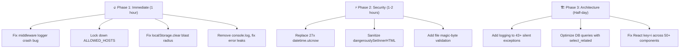

# 🐛 BUGS — Full Project Bug Report & Quick Wins

> **Project:** Multi-Agent Resume & Job Matching Platform (`Mayur-Purohit/Workly`)  
> **Audit Scope:** Full Backend + Frontend + DevOps Code Analysis  
> **Target Standard:** Enterprise / Big-Tech Production Quality  

---

## 📋 Table of Contents
1. [🐛 Real Bugs Found (Crash / Data Corruption Risk)](#-real-bugs-found)
2. [⚡ Quick Wins (Can Fix in < 30 Minutes Each)](#-quick-wins)
3. [🔒 Security Vulnerabilities](#-security-vulnerabilities)
4. [⚡ Performance Bottlenecks](#-performance-bottlenecks)
5. [🎨 Frontend UI/UX Issues](#-frontend-uiux-issues)
6. [📊 Static Data Audit Status (Previously Resolved)](#-static-data-audit-status)
7. [🗺️ Implementation Roadmap](#-implementation-roadmap)

---

## 🐛 Real Bugs Found

### BUG-1: 🔴 `logger` Not Imported in `ExceptionSanitizationMiddleware` — **CRASH BUG**
- **File:** [`middleware.py:148`](file:///d:/Multi-Agent-Resume-Project/Multi-Agent-Resume-Project/backend/api/middleware.py#L148)
- **Problem:** Line 148 calls `logger.exception(...)` but `logger` is never defined or imported anywhere in this file. When any unhandled exception hits this middleware in production (`DEBUG=False`), it will throw a `NameError: name 'logger' is not defined` instead of returning the sanitized 500 JSON response.
- **Impact:** 🔴 **Every unhandled exception in production will crash with a secondary NameError** instead of returning the clean correlation-ID JSON error.
- **Fix (30 seconds):**
  ```python
  # Add at the top of middleware.py (after line 4):
  import logging
  logger = logging.getLogger(__name__)
  ```

---

### BUG-2: 🔴 `ALLOWED_HOSTS = ["*"]` — Wide Open in Production
- **File:** [`settings.py:75`](file:///d:/Multi-Agent-Resume-Project/Multi-Agent-Resume-Project/backend/vishleshan_backend/settings.py#L75)
- **Problem:** `ALLOWED_HOSTS` is set to `["*"]` unconditionally — even when `DEBUG = False`. Django's host header validation is completely bypassed.
- **Impact:** Enables HTTP Host header poisoning attacks (password reset link hijacking, cache poisoning).
- **Fix (1 minute):**
  ```python
  if DEBUG:
      ALLOWED_HOSTS = ["*"]
  else:
      ALLOWED_HOSTS = [h.strip() for h in os.getenv("ALLOWED_HOSTS", "between.indevs.in,api.between.indevs.in").split(",")]
  ```

---

### BUG-3: 🔴 `datetime.utcnow()` Used for JWT Expiry — **Deprecated & Timezone-Unsafe**
- **Files:** [`seeker_auth.py:32`](file:///d:/Multi-Agent-Resume-Project/Multi-Agent-Resume-Project/backend/api/views/seeker_auth.py#L32), [`recruiter_auth.py:80`](file:///d:/Multi-Agent-Resume-Project/Multi-Agent-Resume-Project/backend/api/views/recruiter_auth.py#L80), [`google_auth.py:97`](file:///d:/Multi-Agent-Resume-Project/Multi-Agent-Resume-Project/backend/api/views/google_auth.py#L97), [`github_auth.py:141`](file:///d:/Multi-Agent-Resume-Project/Multi-Agent-Resume-Project/backend/api/views/github_auth.py#L141), [`developer/auth.py:80`](file:///d:/Multi-Agent-Resume-Project/Multi-Agent-Resume-Project/backend/api/views/developer/auth.py#L80), [`password_reset.py:31`](file:///d:/Multi-Agent-Resume-Project/Multi-Agent-Resume-Project/backend/api/views/password_reset.py#L31)
- **Problem:** `datetime.utcnow()` is deprecated in Python 3.12+ and returns a naive datetime without timezone info. Since Django's `USE_TZ = True` and `TIME_ZONE = 'Asia/Kolkata'`, this creates timezone comparison mismatches with database-stored aware datetimes.
- **Count:** Used in **27 locations** across 11 files.
- **Fix:** Replace all `datetime.utcnow()` with `datetime.now(timezone.utc)`.

---

### BUG-4: 🟡 `dangerouslySetInnerHTML` Without Sanitization — XSS Risk
- **File:** [`ChatPanel.jsx:75`](file:///d:/Multi-Agent-Resume-Project/Multi-Agent-Resume-Project/frontend/src/components/ChatPanel.jsx#L75)
- **Problem:** AI chat responses are rendered using `dangerouslySetInnerHTML` after simple regex bold/list formatting — but without any HTML sanitization (e.g. DOMPurify). If the AI model returns `<script>` tags or event handlers in its response, they will execute.
- **Fix:** Install `dompurify` and sanitize before rendering:
  ```jsx
  import DOMPurify from 'dompurify';
  // In formatMessageText:
  dangerouslySetInnerHTML={{ __html: DOMPurify.sanitize(formattedLine) }}
  ```

---

### BUG-5: 🟡 `localStorage.clear()` on 401 Wipes ALL Keys — Including Third-Party Data
- **File:** [`api.js:69`](file:///d:/Multi-Agent-Resume-Project/Multi-Agent-Resume-Project/frontend/src/lib/api.js#L69)
- **Problem:** When any API request returns 401 (session expired), the code runs `localStorage.clear()` which wipes **all** localStorage keys — not just the app's `vish_jwt`, `vish_api_key`, `vish_company`. This destroys user preferences, theme settings, and any third-party widget state.
- **Fix:** Replace with targeted removal:
  ```javascript
  localStorage.removeItem("vish_jwt");
  localStorage.removeItem("vish_api_key");
  localStorage.removeItem("vish_company");
  localStorage.removeItem("seeker_token");
  localStorage.removeItem("seeker_data");
  ```

---

## ⚡ Quick Wins

### QW-1: 🟢 Remove `console.log` Statements from Production Code
- **Files:** [`DeveloperDocs.jsx:878`](file:///d:/Multi-Agent-Resume-Project/Multi-Agent-Resume-Project/frontend/src/pages/developer/DeveloperDocs.jsx#L878), [`DeveloperLandingPage.jsx:582`](file:///d:/Multi-Agent-Resume-Project/Multi-Agent-Resume-Project/frontend/src/pages/developer/DeveloperLandingPage.jsx#L582), [`useVoiceInterview.js:139`](file:///d:/Multi-Agent-Resume-Project/Multi-Agent-Resume-Project/frontend/src/hooks/useVoiceInterview.js#L139)
- **Problem:** Debug `console.log()` statements left in production code.
- **Fix:** Remove or replace with conditional `import.meta.env.DEV && console.log(...)`.

---

### QW-2: 🟢 CSP Header Blocks Production Frontend Origin
- **File:** [`middleware.py:128-135`](file:///d:/Multi-Agent-Resume-Project/Multi-Agent-Resume-Project/backend/api/middleware.py#L128-L135)
- **Problem:** The `connect-src` in the Content-Security-Policy only allows `http://127.0.0.1:8000`, `http://localhost:8000`, and `https://api.between.indevs.in`. If the production frontend runs on `https://between.indevs.in`, its API requests will be blocked by the CSP.
- **Fix:** Add the production frontend origin to `connect-src`:
  ```
  connect-src 'self' https://between.indevs.in https://api.between.indevs.in ...
  ```

---

### QW-3: 🟢 Duplicate `X-API-Key` Header Names in CORS Config
- **File:** [`settings.py:158-159`](file:///d:/Multi-Agent-Resume-Project/Multi-Agent-Resume-Project/backend/vishleshan_backend/settings.py#L158-L159)
- **Problem:** Both `'x-api-key'` (line 158) and `'X-API-Key'` (line 159) are listed. HTTP headers are case-insensitive; the duplicate is unnecessary.
- **Fix:** Remove the duplicate entry `'X-API-Key'`.

---

### QW-4: 🟢 Error Responses Leak Internal Stack Traces to Frontend
- **Files:** [`seeker_resume.py:119`](file:///d:/Multi-Agent-Resume-Project/Multi-Agent-Resume-Project/backend/api/views/seeker_resume.py#L119), [`seeker_resume.py:623`](file:///d:/Multi-Agent-Resume-Project/Multi-Agent-Resume-Project/backend/api/views/seeker_resume.py#L623)
- **Problem:** Error responses use `f"Server error: {e}"` which exposes Python exception messages (file paths, model names, SQL details) to the client.
- **Fix:** Return generic messages in production: `"An internal error occurred. Please try again."`. Log the full error server-side.

---

### QW-5: 🟢 Silent Exception Swallowing in 43+ Backend Locations
- **Files:** 43+ `except Exception:` blocks across `seeker_resume_builder.py`, `round_views.py`, `ingest.py`, `recruiter_auth.py`, `companies.py`, etc.
- **Problem:** Bare `except Exception:` blocks with no logging. Errors silently vanish, making debugging production issues impossible.
- **Fix:** Add `logger.warning(...)` or `logger.error(..., exc_info=True)` to every bare except block.

---

### QW-6: 🟢 Company `rating` Field Defaults to `4.5` — Fake Default
- **File:** [`models.py:17`](file:///d:/Multi-Agent-Resume-Project/Multi-Agent-Resume-Project/backend/api/models.py#L17)
- **Problem:** Every new company is created with `rating = 4.5` by default. Until real reviews accumulate, every company appears to have a positive rating.
- **Fix:** Change default to `0.0` or `null` and only display ratings after minimum review count is reached.

---

## 🔒 Security Vulnerabilities

### SEC-1: 🔴 JWT Stored in `localStorage` — XSS Token Theft
- **Files:** [`api.js:97-98`](file:///d:/Multi-Agent-Resume-Project/Multi-Agent-Resume-Project/frontend/src/lib/api.js#L97-L98)
- **Problem:** JWT access tokens and API keys are stored in `localStorage`, accessible to any JavaScript running on the page.
- **Impact:** Any XSS vulnerability (including via `dangerouslySetInnerHTML` in BUG-4) can steal authentication tokens.
- **Long-term Fix:** Move tokens to `HttpOnly`, `Secure`, `SameSite=Lax` cookies.

---

### SEC-2: 🔴 50+ Endpoints Use `@csrf_exempt` Without JWT Middleware
- **Files:** All view files in `backend/api/views/`
- **Problem:** Over 50 view functions use `@csrf_exempt`. While the app uses custom JWT headers (not Django sessions), the `@csrf_exempt` pattern is fragile — if any view accidentally uses session auth, CSRF protection is silently bypassed.
- **Recommendation:** Migrate to DRF `@api_view` decorators with explicit `@authentication_classes([JWTAuthentication])`.

---

### SEC-3: 🟡 No File Magic-Byte Validation on Resume Uploads
- **File:** [`seeker_resume.py:43-48`](file:///d:/Multi-Agent-Resume-Project/Multi-Agent-Resume-Project/backend/api/views/seeker_resume.py#L43-L48)
- **Problem:** File validation only checks the file extension (`.pdf`, `.docx`). A `.pdf` file with malicious binary content will pass validation.
- **Fix:** Read the first 2048 bytes and verify magic bytes (`%PDF-` for PDF, `PK` for DOCX).

---

## ⚡ Performance Bottlenecks

### PERF-1: 🟡 N+1 Queries in Job/Application List Views
- **Files:** `companies.py`, `seeker_jobs.py`, `candidates.py`
- **Problem:** Some views iterate over querysets and access foreign keys without `select_related()` or `prefetch_related()`.
- **Fix:** Add `.select_related('session', 'session__company')` and `.prefetch_related('session__skills')` to queryset fetches.

---

### PERF-2: 🟡 Synchronous AI/LLM Calls Block HTTP Worker Threads
- **Files:** `seeker_resume_builder.py`, `ml_views.py`
- **Problem:** OpenAI/Gemini API calls (5-15s latency) are executed synchronously inside the HTTP request-response cycle.
- **Long-term Fix:** Offload to Celery/Redis background worker queue.

---

## 🎨 Frontend UI/UX Issues

### UI-1: 🟢 Array Index Used as React `key` in 50+ Locations
- **Files:** `UserProfile.jsx`, `UserJobs.jsx`, `UserDashboard.jsx`, `ResumeEditor.jsx`, `LandingPage.jsx`, `SessionWorkspacePage.jsx`, etc.
- **Problem:** Using `key={i}` (array index) causes React to incorrectly reuse DOM nodes when list items are reordered, added, or removed — leading to stale UI state.
- **Fix:** Use unique identifiers (item `id`, `slug`, or `name`) as keys instead of array indices.

---

### UI-2: 🟢 ErrorBoundary Already Exists ✅
- **File:** [`ErrorBoundary.jsx`](file:///d:/Multi-Agent-Resume-Project/Multi-Agent-Resume-Project/frontend/src/components/ErrorBoundary.jsx) — properly implemented with chunk error recovery and branded fallback UI.
- **Status:** ✅ Already resolved and wrapped in [`App.jsx:180-311`](file:///d:/Multi-Agent-Resume-Project/Multi-Agent-Resume-Project/frontend/src/App.jsx#L180-L311).

---

## 📊 Static Data Audit Status

All 10 items from the original `static_data_audit.md` have been resolved:

| # | Item | Status |
|---|------|--------|
| 1 | Job Category Counts → live DB aggregation | ✅ Resolved |
| 2 | Stats Strip → real DB counts, fallback `0` | ✅ Resolved |
| 3 | Scrolling Ticker → dynamic platform metrics | ✅ Resolved |
| 4 | Company Logo Strip → real DB companies | ✅ Resolved |
| 5 | `data.js` mock imports removed | ✅ Resolved |
| 6 | Market Trends → `publicAPI.getMarketTrends()` | ✅ Resolved |
| 7 | Pricing Plans → consolidated `constants.js` | ✅ Resolved |
| 8 | Location fallback → `"—"` | ✅ Resolved |
| 9 | Testimonials → avatar photos + timestamps | ✅ Resolved |
| 10 | Chrome banners → centralized constants | ✅ Resolved |

---

## 🗺️ Implementation Roadmap

### 🔥 Phase 1: Immediate Fixes (< 1 hour total)

| Priority | Item | Time |
|----------|------|------|
| 🔴 **BUG-1** | Add `import logging; logger = logging.getLogger(__name__)` to `middleware.py` | 30 sec |
| 🔴 **BUG-2** | Make `ALLOWED_HOSTS` conditional on `DEBUG` in `settings.py` | 1 min |
| 🟡 **BUG-5** | Replace `localStorage.clear()` with targeted key removal in `api.js` | 2 min |
| 🟢 **QW-1** | Remove debug `console.log()` from production files | 5 min |
| 🟢 **QW-3** | Remove duplicate `X-API-Key` from CORS headers | 30 sec |
| 🟢 **QW-4** | Replace `f"Server error: {e}"` with generic messages | 10 min |
| 🟢 **QW-6** | Change Company `rating` default from `4.5` to `0.0` | 1 min |

### ⚡ Phase 2: Security Hardening (1-2 hours)

| Priority | Item | Time |
|----------|------|------|
| 🔴 **BUG-3** | Replace all 27 `datetime.utcnow()` calls | 20 min |
| 🟡 **BUG-4** | Install DOMPurify and sanitize `dangerouslySetInnerHTML` | 10 min |
| 🟢 **QW-2** | Fix CSP `connect-src` to include production frontend origin | 5 min |
| 🟡 **SEC-3** | Add file magic-byte validation to resume uploads | 15 min |

### 🏗️ Phase 3: Architecture Improvements (Half-day)

| Priority | Item | Time |
|----------|------|------|
| 🟡 **QW-5** | Add logging to 43+ bare `except Exception:` blocks | 30 min |
| 🟡 **PERF-1** | Add `select_related`/`prefetch_related` across views | 30 min |
| 🟢 **UI-1** | Replace `key={i}` with unique keys across 50+ components | 45 min |

---



---
*Generated from full codebase analysis of `Mayur-Purohit/Workly`*
