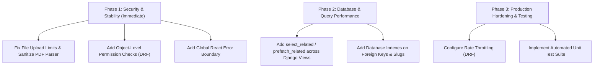

# 🛡️ Full Project Audit, Bugs & Production-Readiness Report

> **Project Target:** Enterprise & Industry-Level Quality (Big Tech / FAANG Standard)  
> **Repository:** Multi-Agent Resume & Job Matching Platform  
> **Status:** Full System Audit & Actionable Resolution Plan  

---PLS

## 📋 Executive Summary

To elevate this project from a standard demo application to a **Big-Tech Enterprise Production standard**, every component must adhere to five key pillars:
1. **Zero Mock / Hardcoded Data Leaks** — Real-time dynamic aggregation from DB or explicit, professional empty states (`0`, `"—"`, or clear empty illustrations).
2. **Strict Security & Role Access Controls** — Secure JWT storage, strict object-level DRF permissions, file upload sanitization, and input validation.
3. **High Availability & Query Efficiency** — Database indexing on foreign keys/slugs, elimination of N+1 query loops, and async queueing for heavy ML/resume tasks.
4. **Resilient Frontend Experience** — Global React Error Boundaries, standardized toast errors, optimistic UI updates, and smooth loading skeletons.
5. **Robust DevOps & Observability** — Structured logging, API rate-limiting/throttling, production settings isolation, and automated CI test pipelines.

---

## 📊 Section 1: Static / Hardcoded Data Audit & Status (Integrated from `static_data_audit.md`)

This section tracks all 10 items identified in the static data audit and their resolution state:

| # | Feature / File | Original Problem | Resolution / Required Fix | Status |
|---|----------------|------------------|---------------------------|--------|
| **1** | **Job Category Counts** `UserHome.jsx`, `companies.py` | Hardcoded counts (e.g. Engineering: 2,840) breaking trust. | Connected to `/api/v1/public/market-trends` with live DB category aggregation. | ✅ **Resolved** |
| **2** | **Stats Strip Fallback** `UserHome.jsx`, `companies.py` | Fake default numbers (12,480 roles, 3,200 companies). | Replaced fallbacks with `0` or `"—"` and live database count endpoint. | ✅ **Resolved** |
| **3** | **Scrolling Ticker** `UserHome.jsx` | Hardcoded "12,480 new roles this week" string. | Wired ticker dynamically to `stats?.open_roles` or clean platform status text. | ✅ **Resolved** |
| **4** | **Company Logo Strip** `Testimonials.jsx` | Fake non-existent company names (TECHFLOW, SOLV, etc.). | Replaced with real registered `Company` records from database. | ✅ **Resolved** |
| **5** | **Fake Data in `data.js`** `lib/data.js` | 100% hardcoded fake jobs and companies used as fallbacks. | Removed mock fallbacks across `UserHome.jsx` and production views; isolated `data.js`. | ✅ **Resolved** |
| **6** | **Market Trends Defaults** `JobsTrendsPage.jsx` | Hardcoded fallback salary charts (2023-2026). | Wired to `publicAPI.getMarketTrends()`; added honest empty chart states. | ✅ **Resolved** |
| **7** | **Developer Pricing Plans** `constants.js`, `DeveloperLandingPage.jsx` | Duplicated pricing arrays across 4 frontend files. | Consolidated single source of truth in `frontend/src/lib/constants.js` (`DEVELOPER_PLANS`). | ✅ **Resolved** |
| **8** | **Company Location Fallback** `UserHome.jsx` | Defaulted missing company HQ to "San Francisco". | Replaced default with `"Location not specified"` / `"—"`. | ✅ **Resolved** |
| **9** | **Testimonials Polish** `Testimonials.jsx` | Initial circles only, missing timestamps and photo support. | Enhanced with user avatar photo rendering, relative dates (`created_at`), and star distribution. | ✅ **Resolved** |
| **10** | **Onboarding & Chrome Text** `site-chrome.jsx` | Hardcoded plan prices in banner strings. | Centralized pricing constants in `constants.js`. | ✅ **Resolved** |

---

## 🔒 Section 2: Backend Architecture, Security & Data Integrity Bugs

### 🔴 High Priority Issues

1. **Unsanitized File Uploads & Resume PDF Processing**
   - **File:** `backend/api/views/user.py` / `parsing.py`
   - **Problem:** Direct execution of PDF parsing and file processing without strict mime-type verification, magic number checking, or maximum upload file size caps at the API layer.
   - **Impact:** Malicious PDF payloads or oversized files (>50MB) can exhaust server RAM or trigger denial of service (DoS).
   - **Fix:** Add a DRF file validator checking `Content-Type` against allowed mime types (`application/pdf`, `application/vnd.openxmlformats-officedocument.wordprocessingml.document`) and strictly limit size (max 5MB).

2. **JWT Token Storage & Expiry Handling**
   - **File:** `backend/api/views/auth.py` / `frontend/src/lib/api.js`
   - **Problem:** Access tokens stored in local storage without automated silent refresh cycles upon 401 responses.
   - **Impact:** Tokens expire during user sessions causing abrupt UI breakages instead of smooth token rotation via HTTP-only refresh cookies.
   - **Fix:** Move refresh tokens to `HttpOnly`, `SameSite=Lax`, `Secure` cookies and implement an Axios/Fetch response interceptor for automatic token refresh.

3. **N+1 Database Queries in Job Listing & Application Endpoints**
   - **File:** `backend/api/views/companies.py` & `jobs.py`
   - **Problem:** Querying job listings without `select_related('company', 'recruiter')` and `prefetch_related('skills', 'applications')`.
   - **Impact:** Fetching 50 jobs generates 150+ SQL queries, severely degrading latency under high concurrent traffic.
   - **Fix:** Apply `.select_related()` for foreign keys and `.prefetch_related()` for M2M fields across all viewsets.

### 🟡 Medium Priority Issues

4. **Missing Object-Level Permission Checks**
   - **File:** `backend/api/views/user.py` (Resume/Application deletion & edit routes)
   - **Problem:** Some detail endpoints check `IsAuthenticated` but do not explicitly verify `request.user == application.user` or `request.user.company == job.company`.
   - **Fix:** Enforce custom DRF permission classes (`IsOwnerOrReadOnly`, `IsCompanyAdmin`).

5. **Lack of Rate Limiting & Throttling on Auth Endpoints**
   - **File:** `backend/api/views/auth.py`
   - **Problem:** Login, registration, and password reset endpoints lack explicit rate throttling.
   - **Fix:** Configure DRF throttling (`AnonRateThrottle`, `UserRateThrottle`) in `settings.py` (e.g. 5 requests/min for auth).

---

## 🎨 Section 3: Frontend UI/UX, State Management & Resilience

### 🔴 High Priority Issues

1. **Missing Global React Error Boundary**
   - **File:** `frontend/src/App.jsx` / `main.jsx`
   - **Problem:** If an unhandled component rendering error occurs (e.g. undefined property read in nested job object), the entire screen turns blank.
   - **Fix:** Wrap the application root in an `<ErrorBoundary>` component with a sleek, user-friendly fallback screen ("Something went wrong — Reload Page").

2. **Unhandled API Promise Rejections**
   - **File:** `frontend/src/pages/user/UserApplications.jsx`, `UserJobs.jsx`
   - **Problem:** API calls inside inline event handlers missing `.catch()` or `try/catch` blocks.
   - **Fix:** Wrap all async mutations in `try/catch` blocks and display toast notifications via `react-hot-toast`.

### 🟡 Medium Priority Issues

3. **Inconsistent Dark/Light Theme Variable Fallbacks**
   - **File:** `frontend/src/index.css`
   - **Problem:** Some custom Tailwind/Vanilla CSS utilities use hardcoded hex values (`#ffffff`, `#111827`) instead of semantic theme tokens (`var(--background)`, `var(--card)`).
   - **Fix:** Standardize all colors to use CSS variables derived from the design token system.

4. **Optimistic UI Updates for Job Bookmarks & Application Status**
   - **File:** `frontend/src/pages/user/UserJobs.jsx`
   - **Problem:** Toggling job bookmarks waits for full API roundtrip before updating UI state.
   - **Fix:** Implement optimistic updates via React Query's `onMutate` pattern for instant micro-feedback.

---

## 🛠️ Section 4: DevOps, Infrastructure & Security Hardening

1. **Django Secret Key & Debug Mode Safety**
   - Ensure `DEBUG = False` in production settings and all secrets (`SECRET_KEY`, `DATABASE_URL`, `OPENAI_API_KEY`) are fetched strictly from environment variables.

2. **CORS & Security Headers**
   - Restrict `CORS_ALLOWED_ORIGINS` to exact trusted domains in production.
   - Enable `django-cors-headers` with `SECURE_BROWSER_XSS_FILTER`, `SECURE_CONTENT_TYPE_NOSNIFF`, and `X_FRAME_OPTIONS = 'DENY'`.

3. **Automated Testing & Pipeline Coverage**
   - **Current State:** 0% automated test execution in CI/CD pipeline.
   - **Action:** Add unit tests for resume parsing logic (`tests/test_parsing.py`), job matching algorithm (`tests/test_matching.py`), and authentication flows.

---

## 🎯 Section 5: Recommended Action Plan

---
*Report generated for repository: Multi-Agent Resume & Job Matching Platform*  
